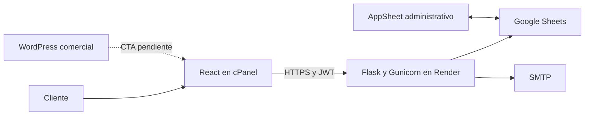

# PRISMALED

Plataforma para consultar disponibilidad y reservar pantallas publicitarias del Bulevar del Río en Cali. React y Flask sirven al cliente; AppSheet gestiona la operación sobre Google Sheets. El sistema está desplegado según el propietario y sus dominios respondieron en la auditoría del 6 de octubre de 2026. Hay hallazgos abiertos: no se recomienda aún el merge final sin su resolución y autorización.

## Producción

- Web: https://reservas.prismawall.com.co, React estático en Latinoamérica Hosting y cPanel.
- API: https://api.prismawall.com.co, servicio prismaled-api en Render.
- Health: GET https://api.prismawall.com.co/healthz; confirma Flask, no Sheets o SMTP.
- Comercial: https://prismawall.com.co/pantallas-led/; integración final PENDIENTE DE VALIDACIÓN DEL CLIENTE.



Cloudflare DNS y un worker Gunicorn fueron declarados por el propietario. No se obtuvo el SHA desplegado ni la configuración completa de paneles; ver guía de operación.

## Tecnología y estructura

```text
prisma-led-back/
  app/config.py             Entorno y JWT
  app/extensions.py         Mail Limiter y locks
  app/routes/               Ocho blueprints API
  app/services/             Sheets validaciones IDs y reintentos
  requirements.txt          Dependencias sin versiones fijadas
  run.py                    Objeto WSGI y entrada local
prisma-led-web/
  src/components/ contexts/ hooks/ layouts/ pages/ router/ services/
  public/.htaccess          Fallback SPA para Apache
  package.json              dev build preview
  package-lock.json         Resolución npm
docs/cierre/                Entrega técnica y documental
```

Frontend: React 18, Vite 4, Tailwind 3, React Router 7, Axios, React Select, SweetAlert2 y Lucide. Backend: Flask, Gunicorn, JWT Extended, Limiter, Mail, gspread, Google Auth/APIs, pandas, Werkzeug y dotenv. AppSheet usa las mismas hojas directamente; no se reconstruye desde este repositorio. La traza identifica automatizaciones Apps Script, cuyo código y triggers no se obtuvieron.
## Instalación y ejecución en desarrollo

Node y npm para el frontend, Python con pip y venv para Flask, una copia de BD_PrismaLed, credenciales de prueba y un buzón SMTP de pruebas. Esta auditoría utilizó Node 24.19.0 y Python 3.12; son versiones de la comprobación local, no una certificación del runtime de producción. Gunicorn se ejecuta en Linux, como en Render; en Windows se usa Flask para desarrollo.

Desde prisma-led-back, crear un entorno virtual y activarlo en PowerShell. Copiar .env.example a .env, completar los valores y crear la carpeta privada credentials. Habilitar Sheets API y Drive API en el proyecto de la cuenta de servicio, descargar su JSON fuera de Git y compartir el Sheet de pruebas con su client_email como editor. El código pide scopes de Sheets y Drive y abre el documento por ID.

```powershell
cd prisma-led-back
python -m venv .venv
.\.venv\Scripts\Activate.ps1
python -m pip install -r requirements.txt
Copy-Item .env.example .env
# Completar .env y el JSON privado antes de ejecutar
python run.py
```

Flask sirve http://127.0.0.1:5000 y /healthz. run.py activa debug solo bajo __main__; nunca se usa python run.py para producción. El import de Config exige MAIL_PORT incluso para el health local. La conexión a Sheets se crea de forma diferida cuando se solicita información.

En otra terminal, desde prisma-led-web:

```powershell
npm ci
Copy-Item .env.example .env.local
npm run dev
```

Vite normalmente abre http://localhost:5173. Mantener ese mismo origen en FRONTEND_URL: 127.0.0.1 y localhost son orígenes diferentes. Configurar VITE_API_URL con el sufijo /api. Evitar un .env.local con localhost al construir para producción; usar la variable de producción de forma explícita.

```powershell
$env:VITE_API_URL = 'https://api.prismawall.com.co/api'
npm run build
npm run preview
```

Vite produce dist, incluyendo public/.htaccess. npm ci respeta package-lock.json; el backend tiene dependencias sin versiones fijadas y por ello dos instalaciones pueden resolver versiones diferentes. Capturar las versiones del servicio vigente antes de actualizar requirements.
## Variables de entorno

| Variable | Uso y valor de referencia sin secretos |
| --- | --- |
| SECRET_KEY | Firma interna Flask. Valor aleatorio privado, diferente entre entornos. |
| JWT_SECRET_KEY | Firma JWT. Valor aleatorio privado, no entregarlo al frontend. |
| SPREADSHEET_ID | Identifica el Sheet autorizado. Usar una copia de pruebas en desarrollo. |
| GOOGLE_CREDENTIALS_PATH | Ruta del JSON de cuenta de servicio; local credentials/credentials.json y en Render la ruta absoluta de Secret File. |
| MAIL_SERVER | Servidor SMTP del proveedor contratado. |
| MAIL_PORT | Puerto SMTP entero; ejemplo 587. Obligatorio: int(None) impediría importar Config. |
| MAIL_USE_TLS | Solo el literal True activa TLS en el código actual. |
| MAIL_USERNAME | Usuario SMTP privado. Recuperación lo usa además como remitente explícito. |
| MAIL_PASSWORD | Contraseña SMTP privada. |
| MAIL_DEFAULT_SENDER | Remitente predeterminado para confirmaciones. |
| FRONTEND_URL | Origen CORS único. Desarrollo http://localhost:5173; producción https://reservas.prismawall.com.co. |
| VITE_API_URL | URL pública de API que Vite inserta durante el build. Local http://localhost:5000/api; producción https://api.prismawall.com.co/api. |

Config lee las once variables de backend anteriores. FRONTEND_URL se lee en la fábrica Flask. VITE_API_URL no es un secreto: cualquier visitante puede ver su valor en el JavaScript compilado. Cambiarla exige un nuevo build. PORT lo proporciona Render y lo consume el comando de inicio propuesto; no es una variable leída por Config.
## Nomenclatura funcional y nombres internos

| Lenguaje de usuario | Código y hojas físicas |
| --- | --- |
| Reserva | prereserva, prereservas, detalle_prereserva |
| Pauta | reserva, reservas, detalle_reserva |

Estos nombres físicos se conservan. El historial de pautas usa /api/reservas/cliente/completo. Editar reservas usa /api/prereservas/cliente y /detalle. Los nombres de componentes Pre_Orden, Historial_Reservas y PrereservaContext son internos; no prueban que exista un concepto comercial adicional.

## Reglas importantes

- Un cupo = 20 segundos, máximo tres por pantalla en ciclo de 60 segundos.
- Un mes de la UI = cuatro semanas. Disponibilidad cruza pautas y reservas con límites inclusivos y restricción de categoría por cilindro para otros clientes.
- Diciembre: COP 2.000.000 por cupo, semana y pantalla; basta que la semana toque diciembre.
- Más de 13 semanas: 3,5 %; más de 26: 10 %. Solo sobre semanas fuera de diciembre. IVA del código: 19 %.
- Tarifas normales leídas el 06/10/2026: 20/40/60 segundos = COP 1.450.000/2.900.000/4.350.000 por semana y pantalla. Son datos del maestro, no precios históricos garantizados.
- JWT: 60 minutos desde emisión; temporizador de inactividad: 60 minutos desde última actividad. Refresh exige JWT todavía válido.
- El guardado crea una reserva pendiente; la formalización como pauta se hace en AppSheet. El correo es posterior al guardado.

## Despliegue y mantenimiento

Backend: GitHub a Render, Root Directory compatible prisma-led-back, pip install -r requirements.txt y objeto WSGI run:app. Comando compatible: gunicorn run:app --workers 1 --bind 0.0.0.0:$PORT. Rama vinculada, Start real, runtime, Secret File y auto deploy quedan pendientes de panel; no inventar sus valores.

Frontend: npm run build, ZIP del contenido completo de dist, extracción en Document Root confirmado del subdominio y conservación de .htaccess. Respaldar antes de reemplazar. Cloudflare declarado: CNAME api a destino Render y A reservas a IP del hosting; verificar en panel. Publicar o revertir producción requiere autorización.

Troubleshooting: MAIL_PORT debe existir para importar Config; CORS exige origen exacto; fallo de Sheets requiere revisar ID, permisos y ruta del JSON; un 404 al recargar ruta requiere .htaccess y mod_rewrite; una API localhost exige corregir variable y reconstruir. El rollback de código no restaura datos de Sheets.

## Pruebas seguridad y deuda

No hay app/tests ni suite k6 vigente en esta rama; package.json no define test. La auditoría verificó health, JWT y CORS local, sintaxis Python y precios, y reprodujo cuatro hallazgos con Sheets y SMTP simulados. El build estándar quedó limitado por EPERM de Windows; un build temporal preserveSymlinks compiló sin cambiar configuración versionada. No se repitieron operaciones destructivas en producción.

Rate limits: login 10/min, registro 5/min, recuperación 3/h, refresh 20/min, ciudad POST 3/min, perfil PUT 5/min, disponibilidad 5/min, ciudad GET 10/min y tarifas de reservas 20/min. Defaults 200/día y 50/h se aplican por endpoint a rutas sin límite explícito; no equivalen a una cuota global acumulada. Storage en memoria y locks por proceso exigen evaluar coordinación antes de escalar. Tampoco protegen escrituras externas AppSheet.

El escaneo de patrones no halló credenciales en el árbol actual; no certifica todo el historial. Nunca versionar .env, JSON privado, claves, tokens o registros personales. npm audit reporta alertas que necesitan evaluación y actualización controlada; no se aplicó audit fix.

Hallazgos abiertos: confirmación sin validar propietario, creación sin revalidar capacidad, categoría tomada de otra reserva y POST categorías incompatible con la hoja real. Ver impacto y criterios de aprobación en deuda. No se modificaron reglas ni lógica funcional en este cierre documental.

## Documentación de entrega

- [Inventario inicial](docs/cierre/00_Inventario_inicial.md)
- [Manual de usuario](docs/cierre/01_Manual_usuario.md)
- [Manual técnico y diccionario](docs/cierre/02_Manual_tecnico.md)
- [Arquitectura y diagramas](docs/cierre/03_Arquitectura.md)
- [Despliegue y operación](docs/cierre/04_Despliegue_operacion.md)
- [Deuda técnica y pendientes](docs/cierre/05_Deuda_pendientes.md)
- [QA y aceptación](docs/cierre/06_QA_aceptacion.md)
- [Resumen ejecutivo](docs/cierre/07_Resumen_ejecutivo.md)
- [Módulo administrativo](docs/cierre/08_Modulo_administrativo.md)
- [Informe de entrega Git](docs/cierre/09_Informe_entrega_git.md)

Los DOCX y PDF se entregan como paquete separado. La documentación distingue evidencia de código, declaración del propietario y comprobación de auditoría. La trazabilidad contractual completa sigue pendiente de documentos históricos no accesibles.

## Control del cierre

Trabajar únicamente en cierre-proyecto y revisar el estado antes de cada commit. No modificar ni mergear main, hacer force push, cambiar historial o crear tags/releases sin autorización explícita. El merge final queda pendiente de resolver hallazgos y de aprobación del propietario. WordPress comercial sigue PENDIENTE DE VALIDACIÓN DEL CLIENTE.
