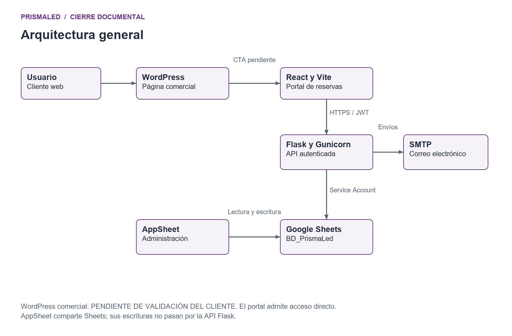
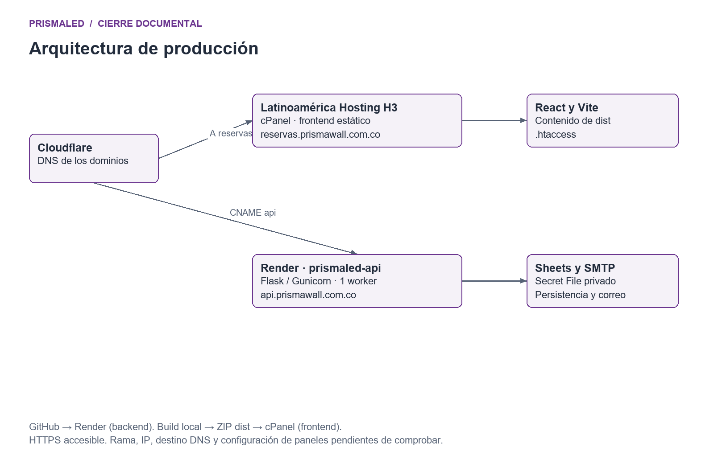
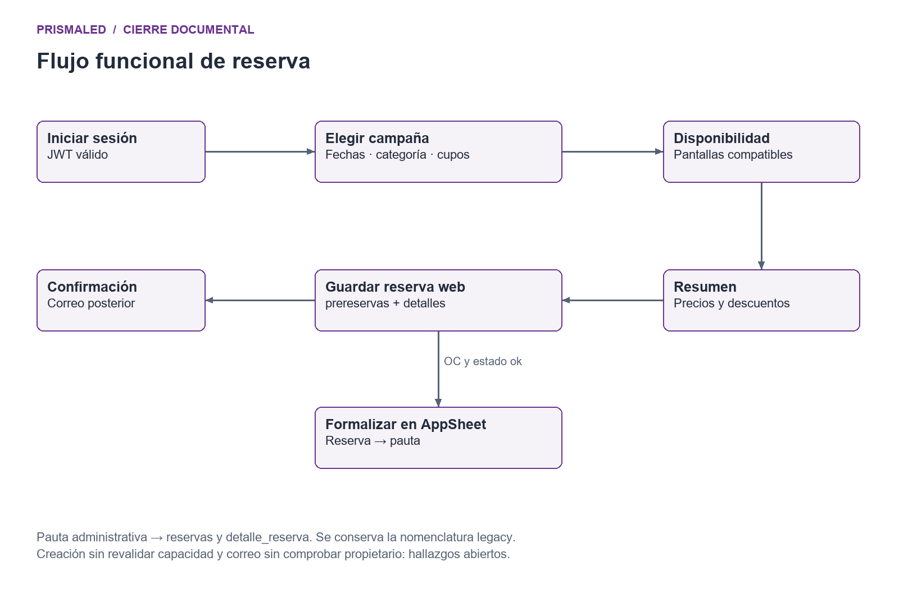
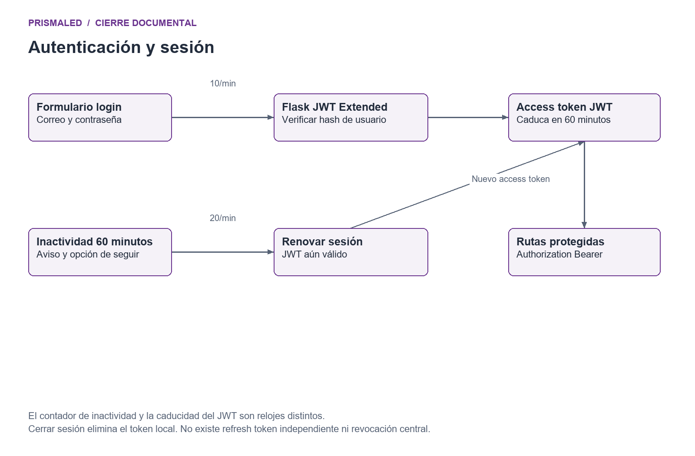
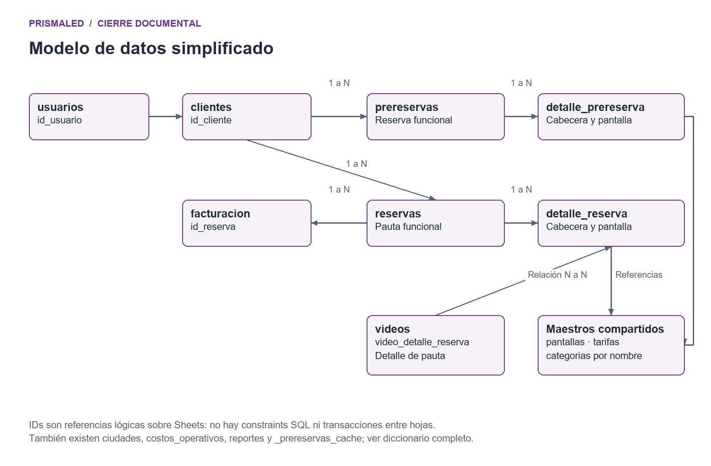
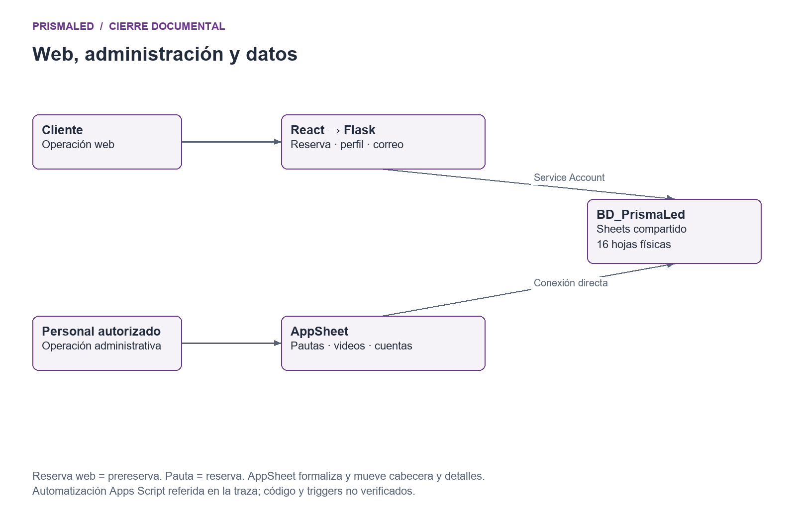

# Arquitectura de PRISMALED

PRISMALED separa la captación comercial, la reserva del cliente y la operación administrativa. La web React y AppSheet comparten la información de Google Sheets. Este documento describe los componentes respaldados por fuentes y entrega seis diagramas editables en Mermaid y SVG, junto con PNG y una versión PDF para presentación.

## Arquitectura general

El usuario puede llegar desde la página comercial WordPress a reservas.prismawall.com.co o abrir directamente ese dominio. La futura sección comercial y su CTA están pendientes de aprobación del cliente; el dibujo representa ese enlace previsto y no certifica que esté implementado. React se comunica por HTTPS y JWT con api.prismawall.com.co. Flask consulta o modifica Sheets y envía mensajes mediante SMTP.

AppSheet administra reservas, pautas, pantallas, videos y contabilidad directamente sobre Sheets. No depende de una llamada a Flask para sincronizar cada operación. La coherencia entre ambos canales exige mantener nombres, IDs y encabezados. Los locks de Flask no cubren cambios simultáneos de AppSheet.

## Producción y límites de comprobación

Según el propietario, Cloudflare gestiona DNS, el frontend se publica en Latinoamérica Hosting Web H3 mediante cPanel y el servicio prismaled-api corre en Render con Gunicorn y un worker. El repositorio no incluye render.yaml ni manifiesto de esa configuración. El dominio público y /healthz respondieron por HTTPS en la auditoría, pero eso no permite certificar el worker, el modo de proxy DNS, el plan contratado o el SHA desplegado.

Cloudflare se muestra como DNS declarado; no se afirma que todo el tráfico atraviese su proxy. CNAME api apunta al hostname que Render proporciona para el servicio. A reservas apunta a la IP del hosting confirmada en cPanel. No se inventa una dirección IP ni un destino exacto onrender.com. La web usa /api como base de sus solicitudes. WordPress tiene su propio dominio comercial.

## Flujo de reserva

El cliente inicia sesión, selecciona fechas y categoría, consulta capacidad y elige pantallas y cupos. Revisa el resumen, confirma el guardado de la reserva y recibe la pantalla de referencia PW. El envío de correo es una operación posterior al guardado; su fallo no demuestra que la reserva haya fallado. La administración revisa documentos y material y formaliza la pauta.

El diagrama describe el recorrido habitual; no declara validaciones inexistentes. La creación no revalida en servidor la disponibilidad antes de escribir. La formalización AppSheet copia cabecera y detalles y borra la reserva original; requiere cuidado por no ser una transacción SQL.

## Autenticación

Login envía correo y contraseña por HTTPS, Flask comprueba el hash y firma un JWT de 60 minutos. React lo guarda y lo envía en Authorization Bearer. La API valida JWT en rutas protegidas. Una respuesta 401 provoca nuevo acceso en las pantallas privadas. La recuperación usa contraseña temporal por correo; el refresh requiere un token válido.

## Modelo de datos simplificado

El diagrama E parte del ER final de Drive y los encabezados actuales. Muestra claves y relaciones principales de clientes, reservas, pautas, detalles, pantallas, tarifas, categorías, facturación y videos. No incluye la entidad sin título que aparece como elemento suelto en el ER histórico: no existe una hoja física que la respalde. reportes, costos_operativos y _prereservas_cache existen como tablas auxiliares y no se les inventan relaciones.

Las líneas representan referencias lógicas de AppSheet o del código, no constraints de Sheets. Una cabecera puede tener múltiples detalles; cada detalle referencia una pantalla, una categoría por nombre y una tarifa. Una pauta puede tener registros de facturación y un video se asocia a un detalle de pauta mediante video_detalle_reserva. El vínculo usuarios a clientes representa la identidad del alta web; no obliga a que todo usuario administrativo sea cliente.

## Relación con administración

La caché oculta y los campos de aviso indican el apoyo a automatizaciones externas descritas en la traza. No se obtuvo Apps Script para acreditar horario, remitentes, ejecución o reglas exactas de borrado. SMTP Flask y automatizaciones externas deben documentarse como canales separados. La arquitectura no contiene pagos en línea, base SQL, cola de mensajes, Redis ni integración directa con reproductores de pantallas en el repositorio auditado.

## Formatos y uso de diagramas

Los archivos A a F están en diagramas. Mermaid permite editar relaciones; SVG conserva vectores; PNG facilita insertar en Word o presentación. Diagramas_PRISMALED.pdf agrupa las seis figuras. El diccionario completo de hojas y endpoints está en el manual técnico y no se sustituye por el modelo simplificado.
## Fuentes y límites de verificación

Fuentes: cierre-proyecto (d47a6ee2af98501a1bd168ac93bac57b2d948d0d), encabezados y tarifas de BD_PrismaLed en Drive Bulevar, ER-PRISMA-FINAL.png, exportación AppSheet del 30/09/2026, presentación comercial de 2025 y cinco turnos recientes disponibles del chat de cierre. Consulta: 06/10/2026. No se leyó el historial completo ni se obtuvo el SHA desplegado, los paneles de producción o Apps Script. El flujo operativo satisfactorio es declaración del propietario. Propuesta, cronograma, preguntas, requisitos, historias General/M1/M2 y prisma-led.zip no se localizaron; la trazabilidad contractual queda pendiente. No se copiaron registros personales ni credenciales. El inventario detalla la disponibilidad de cada fuente.
